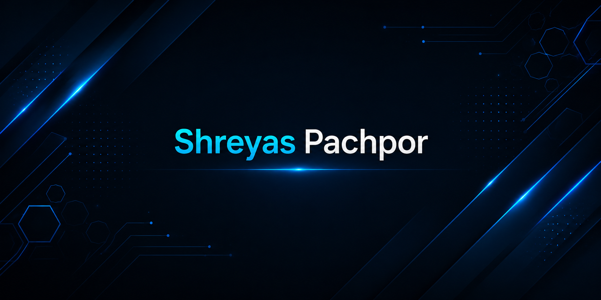

  

<h2 align="left">Connect with me:</h2>

<h2 align="left">Tech Stack:</h2>

  
  

<h2 align="left">About Me:</h2>

🎓 B.Tech graduate in Information Technology. 
🚀 Passionate about building software, solving challenging problems, and turning ideas into real-world applications. 
🧩 I enjoy learning new technologies, experimenting with different tools, and understanding how systems work behind the scenes. 
⚡ Always looking for opportunities to improve my skills through hands-on projects and continuous learning. 
🤝 Open to collaborating on interesting projects, contributing to open source, and connecting with like-minded developers. 
🎯 My goal is simple: keep learning, keep building, and create software that makes an impact.

